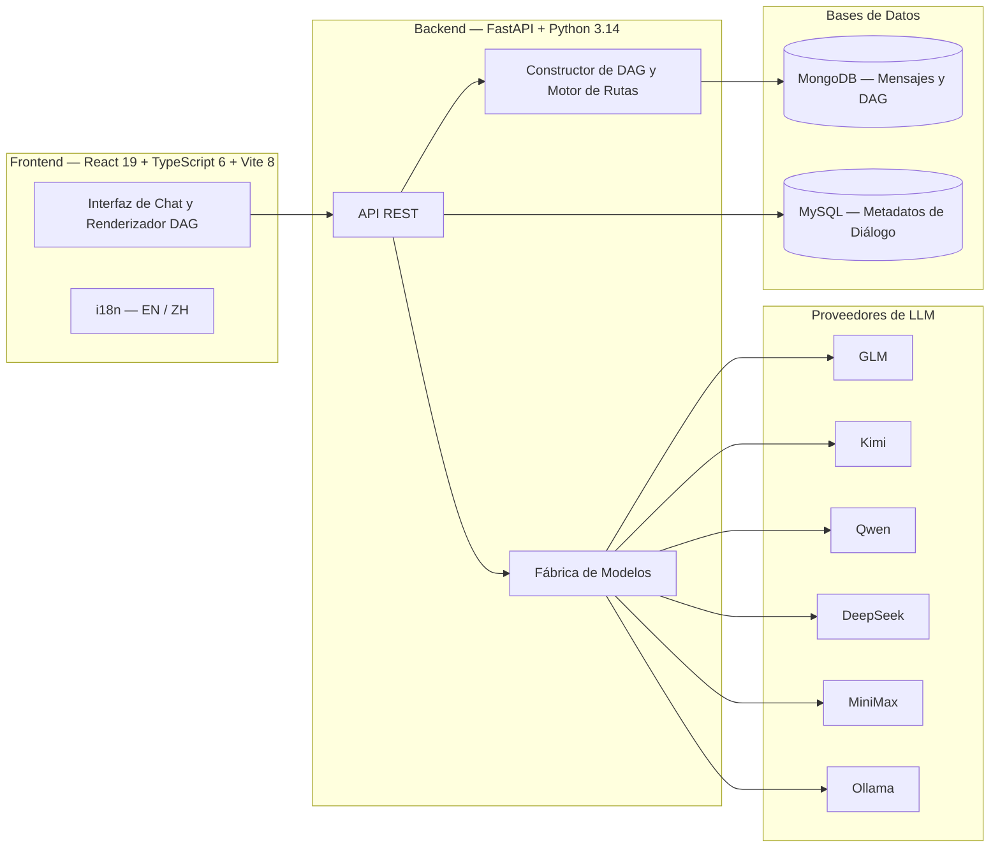

<div align="center">


# DAG-chat

**Conversaciones, Reimaginadas como Grafos**

[](README_zh.md)
[](LICENSE)

*DAG-chat es una aplicación web para conversaciones con LLM que organiza los diálogos como Grafos Acíclicos Dirigidos, permitiendo ramificaciones, fusiones y la exploración no lineal de ideas que las interfaces de chat lineales simplemente no pueden expresar.*

**[中文文档 / Chinese Documentation](README_zh.md)**

</div>

---

## Muestra

<div align="center">
  
</div>

## ¿Por qué DAG-chat?

Las aplicaciones de chat tradicionales fuerzan las conversaciones a un único hilo lineal. Una vez que haces una pregunta, quedas bloqueado a ese camino. **DAG-chat rompe esa limitación.**

| Funcionalidad | Chat Lineal | DAG-chat |
|---------|:-----------:|:--------:|
| Ramificar desde cualquier respuesta | ✗ | ✓ |
| Fusionar múltiples respuestas | ✗ | ✓ |
| Explorar rutas alternativas | ✗ | ✓ |
| Comparación entre múltiples modelos | ✗ | ✓ |
| Edición no destructiva | ✗ | ✓ |
| Cambio instantáneo de ruta | — | ✓ |

## Funcionalidades

- **Estructura de Conversación DAG** — Ramifica y fusiona conversaciones libremente. Cada respuesta es un nodo; cada pregunta puede generar nuevas rutas o converger en existentes.
- **Soporte para Múltiples LLMs** — Alterna sin problemas entre GLM, Kimi, Qwen, DeepSeek, MiniMax y más a través de una interfaz unificada.
- **LLM Local vía Ollama** — Ejecuta modelos localmente con cero costos de API. Detecta automáticamente los modelos de Ollama instalados.
- **Modo de Pensamiento Profundo** — Activa el razonamiento profundo con visualización expandible/colapsable del proceso de pensamiento.
- **Respuestas en Streaming** — Transmisión en tiempo real de las respuestas del LLM con renderizado interactivo.
- **Markdown y Código** — Renderizado enriquecido con resaltado de sintaxis, matemáticas LaTeX, tablas GFM y soporte para emojis.
- **Internacionalización** — Soporte completo de i18n en inglés y chino.

## Arquitectura



## Cómo Funciona

Cada mensaje en DAG-chat es un **nodo** con referencias bidireccionales, formando un Grafo Acíclico Dirigido:

```
          ┌─────────┐
          │  Root Q │ (primera pregunta del usuario)
          └────┬────┘
               │
          ┌────▼────┐
          │  Ans A  │ (respuesta del asistente)
          └────┬────┘
          ┌────┴────┬─────────┐
          │         │         │
     ┌────▼───┐ ┌───▼───┐ ┌───▼───┐
     │  Q B1  │ │ Q B2  │ │ Q B3  │  ← Ramificación
     └────┬───┘ └───┬───┘ └──┬────┘
          │         │        │
     ┌────▼───┐ ┌───▼───┐    │
     │ Ans C  │ │ Ans D │    │
     └────┬───┘ └───┬───┘    │
          │         │        │
          └────┬────┘        │
          ┌────▼────┐        │
          │  Q E    │◄───────┘  ← Fusión
          └────┬────┘
               │
          ┌────▼────┐
          │  Ans F  │
          └─────────┘
```

- **Ramificación** — Una respuesta del asistente puede dar lugar a múltiples seguimientos del usuario. Haz clic en una pestaña para alternar entre ramas paralelas.
- **Fusión** — Una pregunta del usuario puede hacer referencia a múltiples respuestas del asistente como padres, convergiendo diferentes rutas de exploración.
- **No Destructivo** — Cambiar de ruta nunca elimina nada. Cada ramificación y fusión se preserva y es navegable.

## Uso

### Ramificación — Explora Diferentes Direcciones

¿No estás satisfecho con una respuesta? ¿Quieres probar un ángulo diferente?

1. **Pasa el cursor** sobre cualquier **mensaje del usuario** — aparecerá un icono de ramificación a la izquierda
2. Haz clic en él — el **mensaje del asistente encima** se cita en tu cuadro de entrada
3. Escribe tu nueva pregunta y envía
4. Aparece una **barra de pestañas**, permitiéndote alternar entre todas las ramas


```
Tú: "Explica quicksort"
  → IA: [explicación A]        ← ruta original
  → Tú: "Usa Python en su lugar"  ← ramificado desde la misma respuesta de la IA
  → IA: [explicación B]        ← nueva rama
```

### Fusión — Combina Múltiples Perspectivas

¿Quieres contrastar respuestas de diferentes ramas?

1. **Pasa el cursor** sobre cualquier **mensaje del asistente** — aparecerá un icono de fusión a la derecha
2. Haz clic en él — el mensaje se cita en tu cuadro de entrada
3. Haz clic en más iconos de fusión para citar mensajes adicionales del asistente
4. Escribe tu pregunta de seguimiento y envía — todos los mensajes citados se convierten en el contexto


```
IA: [explicación A]  ──┐
IA: [explicación B]  ──┼── Tú: "Compara A y B, ¿cuál es mejor?"
IA: [explicación C]        IA: [comparación]
```

### Consejos Rápidos

- **Cambia de ruta** — Haz clic en las pestañas sobre la conversación para saltar entre ramas o fuentes de fusión
- **No destructivo** — Las ramificaciones y fusiones nunca eliminan nada. Todas las rutas se preservan
- **Multi-modelo** — Cambia de modelo a mitad de la conversación para comparar salidas de diferentes LLMs

## Inicio Rápido

### Requisitos Previos

- **Python** >= 3.14
- **Node.js** >= 24
- **Docker** >= 29 (opcional, para implementación en contenedores)
- **Docker Compose** >= v5 (opcional, para implementación en contenedores)
- **MongoDB** en `localhost:27017` (solo para desarrollo local sin Docker)
- **MySQL** en `localhost:3306` (solo para desarrollo local sin Docker)

### Configuración de la Base de Datos

**Opción A: Docker (recomendado)**

Todas las dependencias (MongoDB, MySQL, backend, frontend) se inician con un solo comando:

```bash
cp .env.example .env   # edita las claves de API
docker compose up --build
```

**Opción B: Configuración Local**

1. **MySQL** — Crea la base de datos y la tabla:

   ```bash
   mysql -u root -p
   ```

   ```sql
   CREATE DATABASE IF NOT EXISTS dag_chat CHARACTER SET utf8mb4 COLLATE utf8mb4_unicode_ci;
   SOURCE sql/t_conversations.sql;
   ```

2. **MongoDB** — Asegúrate de que MongoDB se esté ejecutando en `localhost:27017`. La base de datos `dag_chat` se creará automáticamente al primer uso.

### Configuración

Copia el archivo de entorno de ejemplo y completa tus claves de API:

```bash
cp .env.example .env
```

Edita `.env` con tus claves de API de LLM (GLM, Kimi, Qwen, DeepSeek, MiniMax) y tu contraseña de MySQL.

 **¿ **¿No tienes claves de API?** No hay problema — consulta [Usando Ollama (Gratis, Sin Claves de API)](#using-ollama-free-no-api-keys) más abajo.

### Iniciar

```bash
git clone https://github.com/ZM-BAD/DAG-chat.git
cd DAG-chat

# Inicia frontend y backend
./start.sh --all
```

- **Frontend**: http://localhost:3000
- **API Backend**: http://localhost:8000

<details>
<summary>Inicio manual (opcional)</summary>

Backend:
```bash
source ../.venv/bin/activate
cd backend && pip install -r requirements.txt
python3 run_api.py
```

Frontend:
```bash
cd frontend && npm install --legacy-peer-deps
npm run dev
```

Detén todos los servicios: `./start.sh --stop`

</details>

## Usando Ollama (Gratis, Sin Claves de API)

DAG-chat es compatible con [Ollama](https://ollama.com) para ejecutar LLMs localmente — **completamente gratis, sin necesidad de claves de API**. Esta es la forma más sencilla de comenzar.

### 1. Instalar Ollama

```bash
# macOS
brew install ollama

# Linux
curl -fsSL https://ollama.com/install.sh | sh

# O descarga desde https://ollama.com/download
```

### 2. Descargar un Modelo

```bash
# Recomendado para chino e inglés (8B, ~5GB)
ollama pull qwen3:8b

# Otras buenas opciones:
ollama pull llama3.2          # Enfocado en inglés, más pequeño
ollama pull deepseek-r1:8b    # Soporta razonamiento
ollama pull glm4:9b           # Enfocado en chino
```

### 3. Iniciar Ollama

```bash
ollama serve
```

Ollama se ejecuta en `http://localhost:11434` por defecto. DAG-chat lo detectará automáticamente y listará tus modelos instalados en el selector de modelos.

### 4. Iniciar DAG-chat

```bash
./start.sh --all
```

Eso es todo — no se necesitan claves de API. Selecciona cualquier modelo `Ollama - ...` del menú desplegable y comienza a chatear.

### Configuración del Modelo Predeterminado (Opcional)

Si deseas establecer un modelo Ollama predeterminado, añade al `.env`:

```bash
OLLAMA_MODEL=qwen3:8b
```

### Requisitos

- **RAM**: 8GB+ para modelos de 7-8B, 16GB+ para modelos de 13B
- **GPU**: Opcional, pero significativamente más rápido (CUDA, Metal o Vulkan)
- **Disco**: 4-10GB por modelo

## Licencia

Este proyecto está licenciado bajo la [Licencia MIT](LICENSE).

Copyright (c) 2025-present 周铭 (ZM-BAD)

---

<div align="center">

**[Reportar Error](https://github.com/ZM-BAD/DAG-chat/issues) · [Solicitar Funcionalidad](https://github.com/ZM-BAD/DAG-chat/issues) · [Contribuir](https://github.com/ZM-BAD/DAG-chat/pulls)**

</div>
