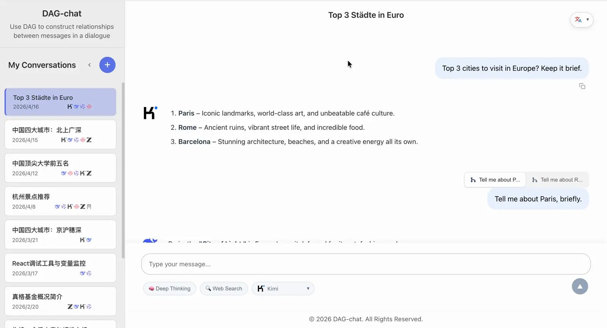
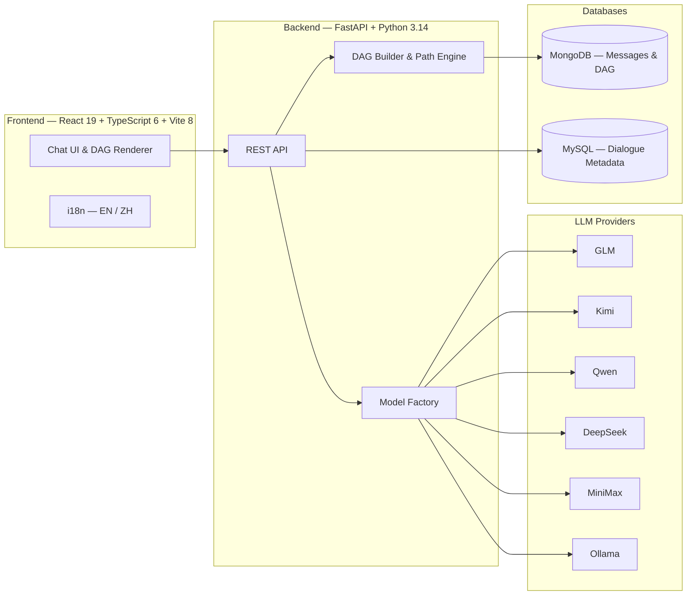
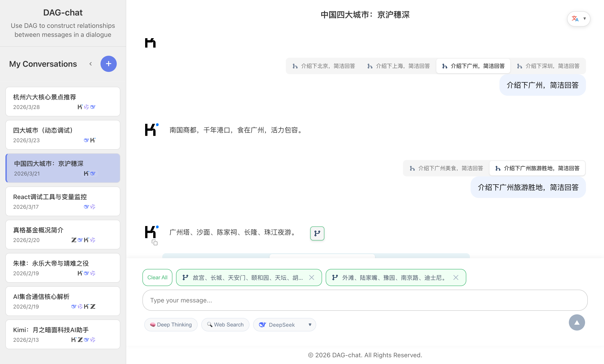

<div align="center">


# DAG-chat

**Conversations, Reimagined as Graphs**

[](README_zh.md)
[](LICENSE)

*DAG-chat is a web-based LLM conversation application that organizes dialogues as Directed Acyclic Graphs — enabling branching, merging, and non-linear exploration of ideas that linear chat interfaces simply cannot express.*

**[中文文档 / Chinese Documentation](README_zh.md)**

</div>

---

## Showcase

<div align="center">
  
</div>

## Why DAG-chat?

Traditional chat applications force conversations into a single, linear thread. Once you ask a question, you're locked into that path. **DAG-chat breaks that limitation.**

| Feature | Linear Chat | DAG-chat |
|---------|:-----------:|:--------:|
| Branch from any response | ✗ | ✓ |
| Merge multiple responses | ✗ | ✓ |
| Explore alternative paths | ✗ | ✓ |
| Multi-model comparison | ✗ | ✓ |
| Non-destructive editing | ✗ | ✓ |
| Instant path switching | — | ✓ |

## Features

- **DAG Conversation Structure** — Branch and merge conversations freely. Every response is a node; every question can spawn new paths or converge existing ones.
- **Multi-LLM Support** — Seamlessly switch between GLM, Kimi, Qwen, DeepSeek, MiniMax, and more through a unified interface.
- **Local LLM via Ollama** — Run models locally with zero API costs. Automatically detects installed Ollama models.
- **Deep Thinking Mode** — Toggle deep reasoning with expandable/collapsible thinking process display.
- **Streaming Responses** — Real-time streaming of LLM responses with interactive rendering.
- **Markdown & Code** — Rich rendering with syntax highlighting, LaTeX math, GFM tables, and emoji support.
- **Internationalization** — Full i18n support with English and Chinese.

## Architecture



## How It Works

Every message in DAG-chat is a **node** with bidirectional references, forming a Directed Acyclic Graph:

```
          ┌─────────┐
          │  Root Q │ (first user question)
          └────┬────┘
               │
          ┌────▼────┐
          │  Ans A  │ (assistant response)
          └────┬────┘
          ┌────┴────┬─────────┐
          │         │         │
     ┌────▼───┐ ┌───▼───┐ ┌───▼───┐
     │  Q B1  │ │ Q B2  │ │ Q B3  │  ← Branching
     └────┬───┘ └───┬───┘ └──┬────┘
          │         │        │
     ┌────▼───┐ ┌───▼───┐    │
     │ Ans C  │ │ Ans D │    │
     └────┬───┘ └───┬───┘    │
          │         │        │
          └────┬────┘        │
          ┌────▼────┐        │
          │  Q E    │◄───────┘  ← Merging
          └────┬────┘
               │
          ┌────▼────┐
          │  Ans F  │
          └─────────┘
```

- **Branching** — One assistant response can lead to multiple user follow-ups. Click a tab to switch between parallel branches.
- **Merging** — One user question can reference multiple assistant responses as parents, converging different exploration paths.
- **Non-destructive** — Switching paths never deletes anything. Every branch and merge is preserved and navigable.

## Usage

### Branching — Explore Different Directions

Not satisfied with one answer? Want to try a different angle?

1. **Hover** over any **user message** — a branch icon appears on the left
2. Click it — the **assistant message above it** is quoted in your input box
3. Type your new question and send
4. A **tab bar** appears, letting you switch between all branches


```
You: "Explain quicksort"
  → AI: [explanation A]        ← original path
  → You: "Use Python instead"  ← branched from the same AI reply
  → AI: [explanation B]        ← new branch
```

### Merging — Combine Multiple Insights

Want to cross-reference answers from different branches?

1. **Hover** over any **assistant message** — a merge icon appears on the right
2. Click it — the message is quoted in your input box
3. Click more merge icons to quote additional assistant messages
4. Type your follow-up question and send — all quoted messages become the context



```
AI: [explanation A]  ──┐
AI: [explanation B]  ──┼── You: "Compare A and B, which is better?"
AI: [explanation C]        AI: [comparison]
```

### Quick Tips

- **Switch paths** — Click tabs above the conversation to jump between branches or merge sources
- **Non-destructive** — Branching and merging never delete anything. All paths are preserved
- **Multi-model** — Switch models mid-conversation to compare outputs from different LLMs

## Quick Start

### Prerequisites

- **Python** >= 3.14
- **Node.js** >= 24
- **Docker** >= 29 (optional, for containerized deployment)
- **Docker Compose** >= v5 (optional, for containerized deployment)
- **MongoDB** on `localhost:27017` (only for local dev without Docker)
- **MySQL** on `localhost:3306` (only for local dev without Docker)

### Database Setup

**Option A: Docker (recommended)**

All dependencies (MongoDB, MySQL, backend, frontend) start with one command:

```bash
cp .env.example .env   # edit API keys
docker compose up --build
```

**Option B: Local setup**

1. **MySQL** — Create the database and table:

   ```bash
   mysql -u root -p
   ```

   ```sql
   CREATE DATABASE IF NOT EXISTS dag_chat CHARACTER SET utf8mb4 COLLATE utf8mb4_unicode_ci;
   SOURCE sql/t_conversations.sql;
   ```

2. **MongoDB** — Ensure MongoDB is running on `localhost:27017`. The `dag_chat` database will be created automatically on first use.

### Configuration

Copy the example environment file and fill in your API keys:

```bash
cp .env.example .env
```

Edit `.env` with your LLM API keys (GLM, Kimi, Qwen, DeepSeek, MiniMax) and MySQL password.

**Don't have API keys?** No problem — see [Using Ollama (Free, No API Keys)](#using-ollama-free-no-api-keys) below.

### Launch

```bash
git clone https://github.com/ZM-BAD/DAG-chat.git
cd DAG-chat

# Start both frontend and backend
./start.sh --all
```

- **Frontend**: http://localhost:3000
- **Backend API**: http://localhost:8000

<details>
<summary>Manual start (optional)</summary>

Backend:
```bash
source ../.venv/bin/activate
cd backend && pip install -r requirements.txt
python3 run_api.py
```

Frontend:
```bash
cd frontend && npm install --legacy-peer-deps
npm run dev
```

Stop all services: `./start.sh --stop`

</details>

## Using Ollama (Free, No API Keys)

DAG-chat supports [Ollama](https://ollama.com) for running LLMs locally — **completely free, no API keys required**. This is the easiest way to get started.

### 1. Install Ollama

```bash
# macOS
brew install ollama

# Linux
curl -fsSL https://ollama.com/install.sh | sh

# Or download from https://ollama.com/download
```

### 2. Pull a Model

```bash
# Recommended for Chinese & English (8B, ~5GB)
ollama pull qwen3:8b

# Other good options:
ollama pull llama3.2          # English-focused, smaller
ollama pull deepseek-r1:8b    # Supports reasoning
ollama pull glm4:9b           # Chinese-focused
```

### 3. Start Ollama

```bash
ollama serve
```

Ollama runs on `http://localhost:11434` by default. DAG-chat will automatically detect it and list your installed models in the model selector.

### 4. Launch DAG-chat

```bash
./start.sh --all
```

That's it — no API keys needed. Select any `Ollama - ...` model from the dropdown and start chatting.

### Configure Default Model (Optional)

If you want to set a default Ollama model, add to `.env`:

```bash
OLLAMA_MODEL=qwen3:8b
```

### Requirements

- **RAM**: 8GB+ for 7-8B models, 16GB+ for 13B models
- **GPU**: Optional but significantly faster (CUDA, Metal, or Vulkan)
- **Disk**: 4-10GB per model

## License

This project is licensed under the [MIT License](LICENSE).

Copyright (c) 2025-present 周铭 (ZM-BAD)

---

<div align="center">

**[Report Bug](https://github.com/ZM-BAD/DAG-chat/issues) · [Request Feature](https://github.com/ZM-BAD/DAG-chat/issues) · [Contribute](https://github.com/ZM-BAD/DAG-chat/pulls)**

</div>
