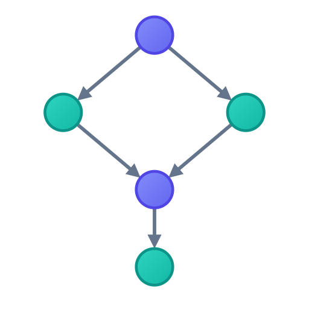
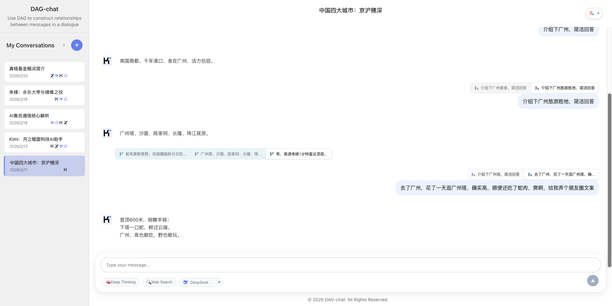
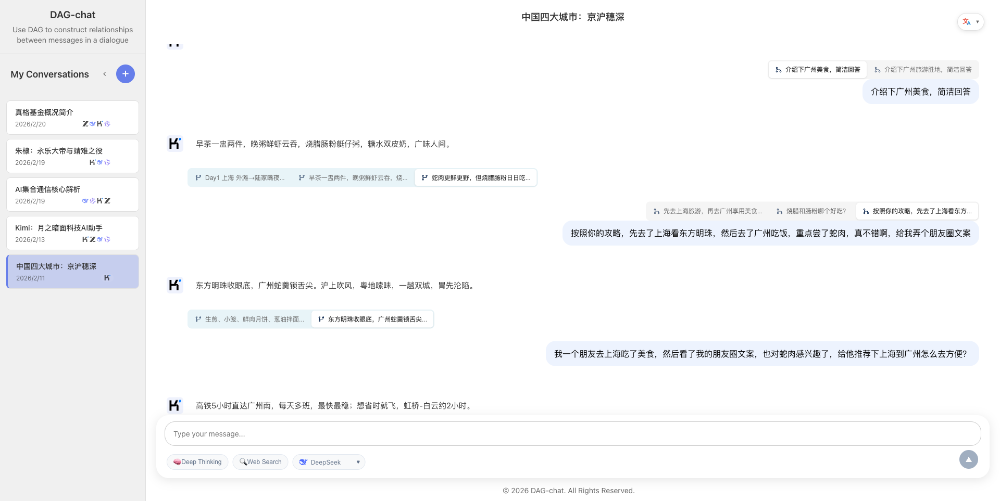
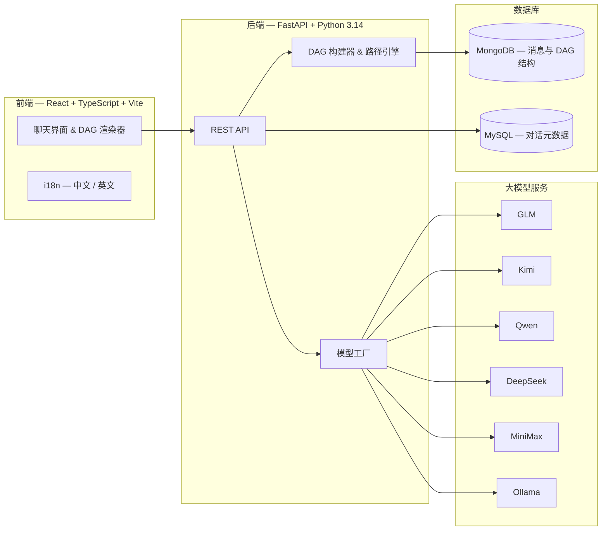
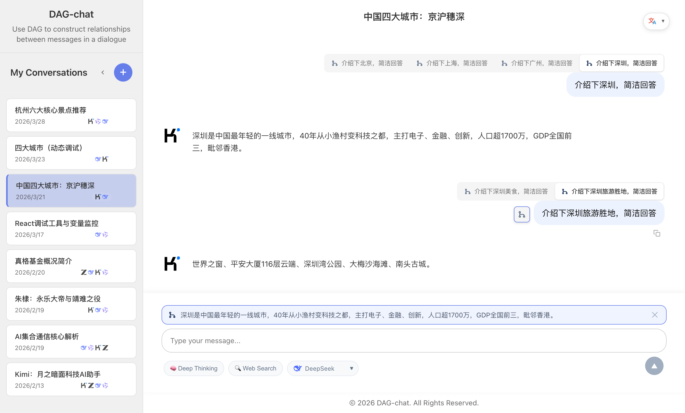

<div align="center">



# DAG-chat

**将对话重构为有向无环图**

[](README.md)
[](LICENSE)

*DAG-chat 是一款基于有向无环图（DAG）组织对话的 Web 端大模型问答应用——支持分支、合并与非线性探索，突破传统线性对话的局限。*

</div>

---

## 应用截图

<table>
  <tr>
    <td align="center"><b>对话总览</b></td>
    <td align="center"><b>DAG 分支与合并</b></td>
  </tr>
  <tr>
    <td></td>
    <td></td>
  </tr>
</table>

## 为什么选择 DAG-chat？

传统聊天应用将对话强制压缩为一条线性线程。一旦你提出问题，就被锁定在这条路径上。**DAG-chat 打破了这一限制。**

| 特性 | 线性对话 | DAG-chat |
|------|:--------:|:--------:|
| 从任意回复分支 | ✗ | ✓ |
| 合并多条回复 | ✗ | ✓ |
| 探索替代路径 | ✗ | ✓ |
| 多模型对比 | ✗ | ✓ |
| 非破坏性编辑 | ✗ | ✓ |
| 路径即时切换 | — | ✓ |

## 功能特性

- **DAG 对话结构** — 自由地分支与合并对话。每条回复是一个节点，每个问题都可以衍生新路径或汇聚已有路径。
- **多模型支持** — 通过统一接口在 GLM、Kimi、Qwen、DeepSeek、MiniMax 等模型之间无缝切换。
- **本地模型 (Ollama)** — 通过 Ollama 在本地运行大模型，零 API 费用，自动检测已安装的本地模型。
- **深度思考模式** — 可开关的深度推理模式，支持展开/折叠思考过程展示。
- **流式响应** — LLM 响应实时流式输出，支持交互式渲染。
- **Markdown 与代码** — 富文本渲染，支持语法高亮、LaTeX 数学公式、GFM 表格和 Emoji。
- **国际化** — 完整的中英文双语支持。

## 架构



## 工作原理

DAG-chat 中的每条消息都是一个具有双向引用的**节点**，构成有向无环图：

```
          ┌─────────┐
          │  Root Q │ (第一个用户提问)
          └────┬────┘
               │
          ┌────▼────┐
          │  Ans A  │ (助手回复)
          └────┬────┘
          ┌────┴────┬─────────┐
          │         │         │
     ┌────▼───┐ ┌───▼───┐ ┌───▼───┐
     │  Q B1  │ │ Q B2  │ │ Q B3  │  ← 分支
     └────┬───┘ └───┬───┘ └──┬────┘
          │         │        │
     ┌────▼───┐ ┌───▼───┐    │
     │ Ans C  │ │ Ans D │    │
     └────┬───┘ └───┬───┘    │
          │         │        │
          └────┬────┘        │
          ┌────▼────┐        │
          │  Q E    │◄───────┘  ← 合并
          └────┬────┘
               │
          ┌────▼────┐
          │  Ans F  │
          └─────────┘
```

- **分支** — 一条助手回复可以派生出多个用户追问。点击标签即可在平行分支间切换。
- **合并** — 一个用户问题可以引用多条助手回复作为父节点，汇聚不同的探索路径。
- **非破坏性** — 切换路径不会删除任何内容。每条分支和合并都被保留且可导航。

## 使用方法

### 分支 — 探索不同方向

对某个回答不满意？想换一个角度试试？

1. **将鼠标悬浮**在任意**用户消息**上 — 左侧会出现分支图标
2. 点击后，**它上方的助手回复**会以引用形式出现在输入框
3. 输入你的新问题并发送
4. 对话中会出现**标签栏**，可以在所有分支之间切换



```
你："解释一下快排"
  → AI：[解释 A]          ← 原始路径
  → 你："用 Python 重写"   ← 从同一条 AI 回复分出的新分支
  → AI：[解释 B]          ← 新分支的回答
```

### 合并 — 融合多条洞察

想交叉对比不同分支的回答？

1. **将鼠标悬浮**在任意**助手消息**上 — 右侧会出现合并图标
2. 点击后，该消息会以引用形式出现在输入框
3. 继续悬浮并点击其他助手消息的合并图标，可以引用多条消息
4. 输入你的追问并发送 — 所有引用的消息都会作为上下文


```
AI：[解释 A] ──┐
AI：[解释 B] ──┼── 你："对比一下 A 和 B，哪个更好？"
AI：[解释 C] ──┘    AI：[对比分析]
```

### 小提示

- **切换路径** — 点击对话上方的标签，即可在分支或合并来源之间跳转
- **非破坏性** — 分支和合并不会删除任何内容，所有路径都被保留
- **多模型** — 对话中随时切换模型，对比不同大模型的输出

## 快速开始

### 环境要求

- **Python** >= 3.14
- **Node.js** >= 24
- **MongoDB** 运行于 `localhost:27017`
- **MySQL** 运行于 `localhost:3306`

### 数据库准备

**方式 A：Docker（推荐）**

所有依赖（MongoDB、MySQL、后端、前端）一条命令启动：

```bash
cp backend/.env.example backend/.env   # 编辑 API Key
docker compose up --build
```

**方式 B：本地安装**

1. **MySQL** — 创建数据库和表：

   ```bash
   mysql -u root -p
   ```

   ```sql
   CREATE DATABASE IF NOT EXISTS dag_chat CHARACTER SET utf8mb4 COLLATE utf8mb4_unicode_ci;
   SOURCE sql/t_conversations.sql;
   ```

2. **MongoDB** — 确保 MongoDB 运行于 `localhost:27017`。`dag_chat` 数据库会在首次使用时自动创建。

### 配置

复制环境变量模板并填入你的 API Key：

```bash
cp backend/.env.example backend/.env
```

编辑 `backend/.env`，填入你的大模型 API Key（GLM、Kimi、Qwen、DeepSeek、MiniMax）和 MySQL 密码。

**没有 API Key？** 没关系 — 参见下方 [使用 Ollama（免费，无需 API Key）](#使用-ollama免费无需-api-key) 章节。

### 启动

```bash
git clone https://github.com/ZM-BAD/DAG-chat.git
cd DAG-chat

# 同时启动前端和后端
./start.sh --all
```

- **前端界面**: http://localhost:3000
- **后端 API**: http://localhost:8000

<details>
<summary>手动启动（可选）</summary>

后端：
```bash
source ../.venv/bin/activate
cd backend && pip install -r requirements.txt
python3 run_api.py
```

前端：
```bash
cd frontend && npm install --legacy-peer-deps
npm run dev
```

停止所有服务：`./start.sh --stop`

</details>

## 使用 Ollama（免费，无需 API Key）

DAG-chat 支持通过 [Ollama](https://ollama.com) 在本地运行大模型 — **完全免费，无需任何 API Key**。这是最简单的上手方式。

### 1. 安装 Ollama

```bash
# macOS
brew install ollama

# Linux
curl -fsSL https://ollama.com/install.sh | sh

# 或从 https://ollama.com/download 下载
```

### 2. 拉取模型

```bash
# 推荐中英文通用（8B，约 5GB）
ollama pull qwen3:8b

# 其他选择：
ollama pull llama3.2          # 偏英文，体积更小
ollama pull deepseek-r1:8b    # 支持推理
ollama pull glm4:9b           # 偏中文
```

### 3. 启动 Ollama

```bash
ollama serve
```

Ollama 默认运行在 `http://localhost:11434`。DAG-chat 会自动检测已安装的模型并显示在模型选择器中。

### 4. 启动 DAG-chat

```bash
./start.sh --all
```

就这么简单 — 无需 API Key。在下拉菜单中选择任意 `Ollama - ...` 模型即可开始对话。

### 配置默认模型（可选）

如需设置默认 Ollama 模型，在 `backend/.env` 中添加：

```bash
OLLAMA_MODEL=qwen3:8b
```

### 硬件要求

- **内存**：7-8B 模型需 8GB+，13B 模型需 16GB+
- **GPU**：非必需，但有 GPU 会显著提速（CUDA、Metal 或 Vulkan）
- **磁盘**：每个模型约 4-10GB

## 许可证

本项目基于 [MIT 许可证](LICENSE) 开源。

Copyright (c) 2025-present 周铭 (ZM-BAD)

---

<div align="center">

**[报告问题](https://github.com/ZM-BAD/DAG-chat/issues) · [功能建议](https://github.com/ZM-BAD/DAG-chat/issues) · [参与贡献](https://github.com/ZM-BAD/DAG-chat/pulls)**

</div>
